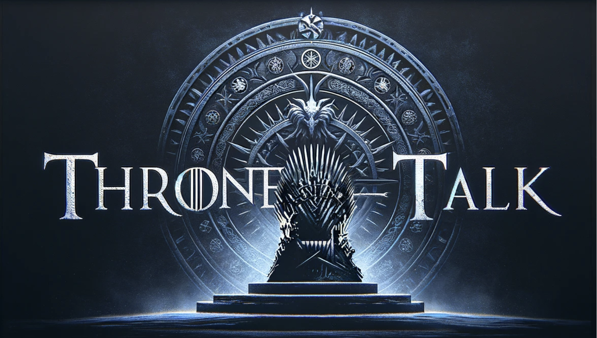

# ThroneTalk - Game of Thrones Summarizer

[](https://coveralls.io/github/DSProjects2024/thronetalk-game-of-thrones-summarizer)





<a id="introduction"></a>
## Introduction
Welcome to the Game of Thrones Summarizer Git repository! Inspired by the beloved TV series Game of Thrones, this project harnesses the transformative capabilities of OpenAI's GPT-3 model to provide users with succinct yet immersive summaries of their chosen episodes. As fans journey through the repository, they can explore the complexities of character relationships, plot twists, and thematic elements that have made Game of Thrones a cultural phenomenon. The purpose of this summarizer is to offer users a convenient tool for revisiting and analyzing key moments from the series, facilitating deeper engagement and understanding of the intricate narrative threads woven throughout each episode. Whether refreshing their memory, preparing for discussions, or simply reliving the excitement of the show, users can rely on the Game of Thrones Summarizer to unlock new layers of appreciation for the epic saga of Westeros.

Public Website: **[thronetalk.streamlit.app](https://thronetalk-summarizer.streamlit.app/)**


#### Team Members:
| Name | GitHub | Name | GitHub |
|:------:|:------:|:------:|:------:|
| **Abhinav Duvvuri** | *abhinavdv*| **Baisakhi Sarkar** | *baisakhi771* |
| **Raagul Nagendran** | *raaguln* | **Swarali Desai** | *swarali-desai* |

## Table of Contents
* [Introduction](#introduction)
* [Tasks of Interest](#tasks-of-interest)
* [Repository Structure](#repository-structure)
* [Installation](#installation)
  * [Environment](#environment)
  * [Data](#data)
  * [Application](#application)
* [Examples](#examples)

<a id="tasks-of-interest"></a>
## Tasks of Interest
- **Interactive Visual Homepage**:
  - Enables users to select specified seasons and episode ranges to generate the analysis.
  - Provides an interactive dashboard showcasing the top characters and their sentiments across the selected episodes.
- **Character Dialogue Analysis**:
  - Allows users to explore word clouds illustrating the most frequently used words by each character in the selected episodes.
  - Presents sentiment analysis graphs depicting the emotional journey of main characters throughout the narrative, offering insights into character development and thematic resonance.
- **Season/Episode Summarizer**:
  - Facilitates comparison between episodes based on various criteria, including dialogue sentiment, character prominence,  and thematic elements.
  - Offers users a comprehensive overview of the series' evolution and narrative arcs, empowering them to identify patterns and themes across different episodes and seasons.


<a id="repository-structure"></a>
## Repository Structure
Here is an overview of our project structure:
```
|--thronetalk-game-of-thrones-summarizer/
|    |--data/
|    |    |-- characters_v4.csv
|    |    |-- episodes_metadata.csv
|    |    |-- episode_metadata.csv
|    |    |-- game-of-thrones.csv
|    |    |-- ouput_dialogues.csv
|    |    |-- ouput_dialogues.csv
|    |    |-- Season_Episode_MultiEpisode.csv
|    |    |-- show_metadata.json
|    |--tests/
|    |    |-- mock_constants.py
|    |    |-- mock_functions.py
|    |    |-- test_app.py
|    |    |-- test_data_analysis.py
|    |    |-- test_get_metadata.py
|    |    |-- test_model.py
|    |    |-- test_visualization_generator.py
|    |    |-- __init__.py
|    |--utils/
|    |    |-- data_analysis.py
|    |    |-- model.py
|    |    |-- visualization_generator.py
|    |    |-- __init__.py
|    |--static/
|    |    |-- thronetalk_title.png
|    |--app.py
|--scripts/
|    |-- data_cleaning.py
|    |-- get_metadata.py
|    |-- __init__.py
|--docs/
|   |--images/
|   |   |--comp_spec_uml.png
|   |-- Component Specification.md
|   |-- Functional Specification.md
|   |--ThroneTalks-TechnologyReview.pdf
|   |--Throne-Talk_final_presentation.pdf
|--examples/
|   |--images/
|   |   |-- site_navigation_1.png
|   |   |-- site_navigation_2.png
|   |   |-- site_navigation_3.png
|   |   |-- site_navigation_4.png
|   |-- README.md
|   |-- site_navigation.md
|-- LICENSE
|-- pyproject.toml
|-- environment.yml
|-- requirements.txt

```

<a id="installation"></a>
## Installation

This repository can be cloned locally by running the following `git` command:
```bash
git clone https://github.com/DSProjects2024/thronetalk-game-of-thrones-summarizer.git
```
Please note that Git is required to run the above command. For instructions on downloading Git, please see [the GitHub guide](https://github.com/git-guides/install-git).

<a id="environment"></a>
### Environment
This application relies on several Python packages with specific version dependencies. Installing these packages may potentially lead to conflicts with existing packages within the workspace. To mitigate this issue, we suggest utilizing `conda` to establish an isolated Python environment containing all essential packages. You can access the list of required packages within the documentation. [`environment.yml`](./environment.yml) file.

To create the 'thronetalks' conda environment which contains all the required packages to run the app, run these commands:

```bash
conda env create -f environment.yml
conda activate thronetalks
```
The second command activates the specific environemnt.


If you want to deactivate this environment in the future, then use the command:
```bash
conda deactivate
```

If you want to delete this environment, then use the following command:
```bash
conda remove --name thronetalks --all
```

<a id="data"></a>
### Data
The raw data for our project was obtained from two different sources:

1. Dialogues for each character - https://www.kaggle.com/datasets/gopinath15/gameofthrones
2. Scrapped metadata from IMBD - metadata for the episodes and the show.

Since all the metadata scraping is one-off and the show has finished airing, we are not expecting to run the scripts again. But we can use the file `scripts/data_cleaning.py` to generate the cleaned data again. (Note - scraper might fail because of IMDb's efforts to prevent web scraping, you might have to manually debug it and run it in batches of 10 episodes if so).

Run the following:
```bash
conda activate thronetalks
python ./scripts/data_cleaning.py
python ./scripts/get_metadata.py
conda deactivate
```
More details can be found [Readme](./scripts/README.md) and [data details](./examples/data.ipynb).

<a id="application"></a>
### Application
We generated our application through the open-source `streamlit` package. A local application can be generated with the code:
```bash
conda activate thronetalks
streamlit run thronetalk-game-of-thrones-summarizer/app.py
```
This will pop up a browser window with the functioning web-application.
More details can be found [here](./examples/README.md).

Note: While running this app locally inorder to generate summary, you will need to specify
```
AZURE_OPENAI_KEY = "YOUR KEY"
AZURE_ENDPOINT = "YOUR DEPLOYED MODEL ENDPOINT"
```
in a secrets.toml file within ```thronetalk-game-of-thrones-summarizer/.streamlit/secrets.toml```

<a id="examples"></a>
## Examples
A video demonstration of our working application can be seen [here](https://drive.google.com/file/d/1GadkwGMEtFOznwmvRZYv9gkUYwnhFoLj/view?usp=sharing).

More details on how to run our app can be found [here](./examples/README.md).

## Disclaimer
This project is created by fans for fans and is not affiliated with or endorsed by HBO or the creators of Game of Thrones.

The word cloud generated for each character might include potentially explicit or inappropriate language.
