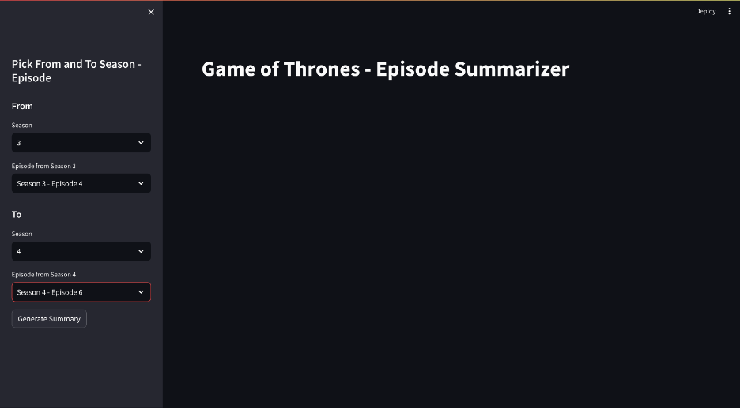
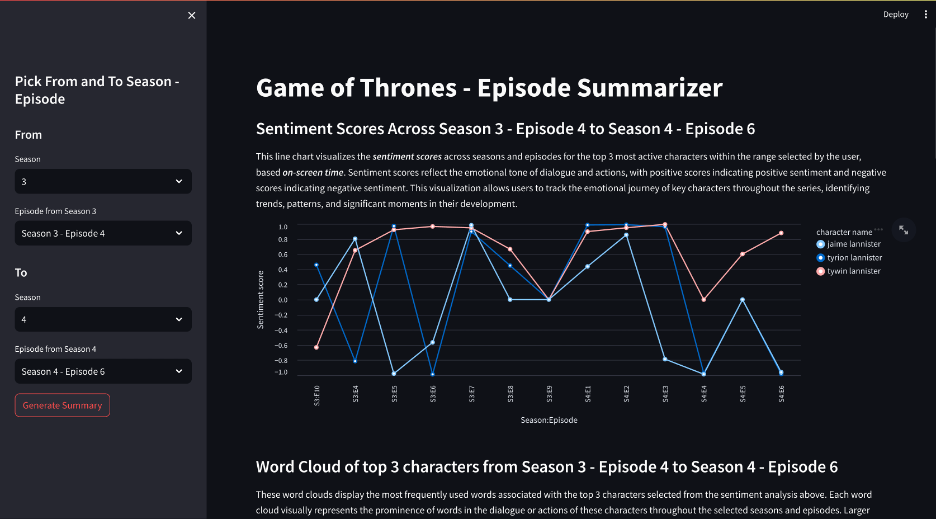
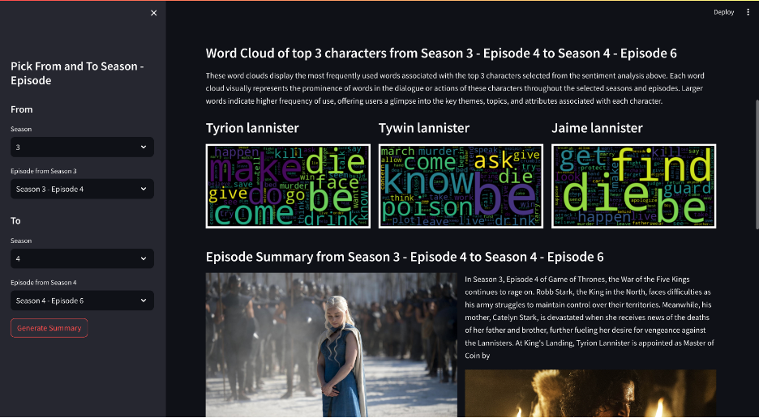
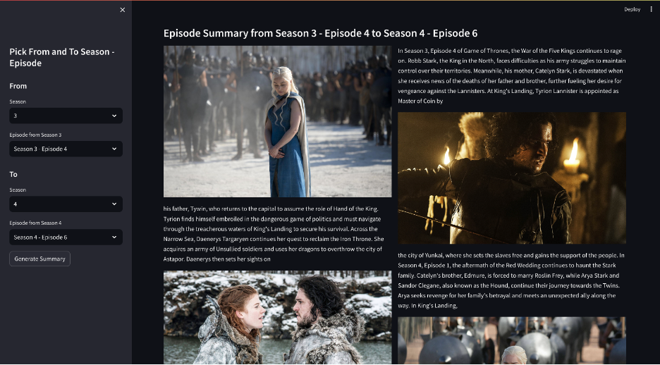

To run this app locally or use our hosted website, Check out ```/examples/README.md```.

## Landing Page

Upon launching the application, users will encounter a picker interface located on the left side. This picker allows users to specify the starting and endin season and episode ranges they wish to analyze. After entering the desired parameters, users can initiate the analysis process by clicking the "Generate Summary" button. The exmaple shows a selection of From: Season 2 episode 4 and To: Season 3 Episode 6.



## Modal page
### Section 1: Sentiment Analysis Visualization
The application generates a line chart illustrating sentiment scores across seasons and episodes for the top three most active characters within the user-defined range. Sentiment scores reflect the emotional tone of dialogue and actions, with positive scores indicating positive sentiment and negative scores indicating negative sentiment. This visualization enables users to track the emotional journey of key characters throughout the series, facilitating the identification of trends, patterns, and significant moments in character development. Hover on the sentiments to see the score and character.



### Section 2: Character Wordclouds
Following the sentiment analysis, the application produces three word clouds representing the most frequently used words associated with the top three characters who speak within the specified episode range. These word clouds visually showcase the prominence of words in the dialogue or actions of these characters throughout the selected seasons and episodes. Larger words indicate higher frequency of use, providing users with insights into the primary themes, topics, and attributes associated with each character.



### Section 3: Summary Generation
Finally, the application generates a summary report summarizing the insights derived from the selected season and episode range. This summary offers a sleek and concise overview, enhancing their understanding of the Game of Thrones narrative and character dynamics.




